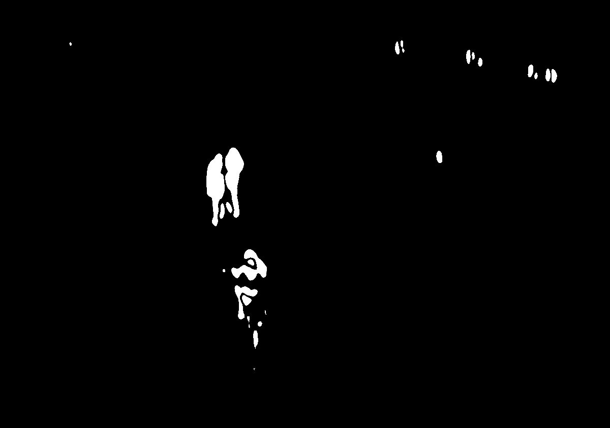

# obj-tracking

Для обнаружения движущихся объектов применяется следующий алгоритм.

В памяти хранится последние 11 кадров записаных с камеры.
Каждый кадр обрабатывается и сравнивается с предыдущим. Сравнение происходит следующим образом:

11 кадров нужно что бы мало подвижные объекты имели достаточное смещение для его определения.
Сравнивается текущий кадр, с -11, следующий с -10, и так далее n + k, n + k - 11...

1. Кадры переводятся в ч\б диапазон.

1. Для простого устранения шумов, применяется размытие.

1. Из текущего (размытого) кадра вычитается предыдущий.

1. Повышается контраст разницы кадров.

1. Над контрастом разницы кадров, применяется смазывание границ, что бы близкостоящие области слились в одну.

1. На результирующем кадре производиться поиск контуров.

Каждый найденый контур сравнивается с гистограммой изображения цели:

Сравнение осуществляется выражением:

где

##Результат

